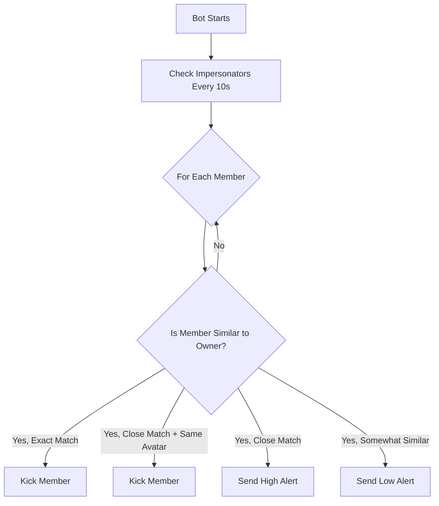
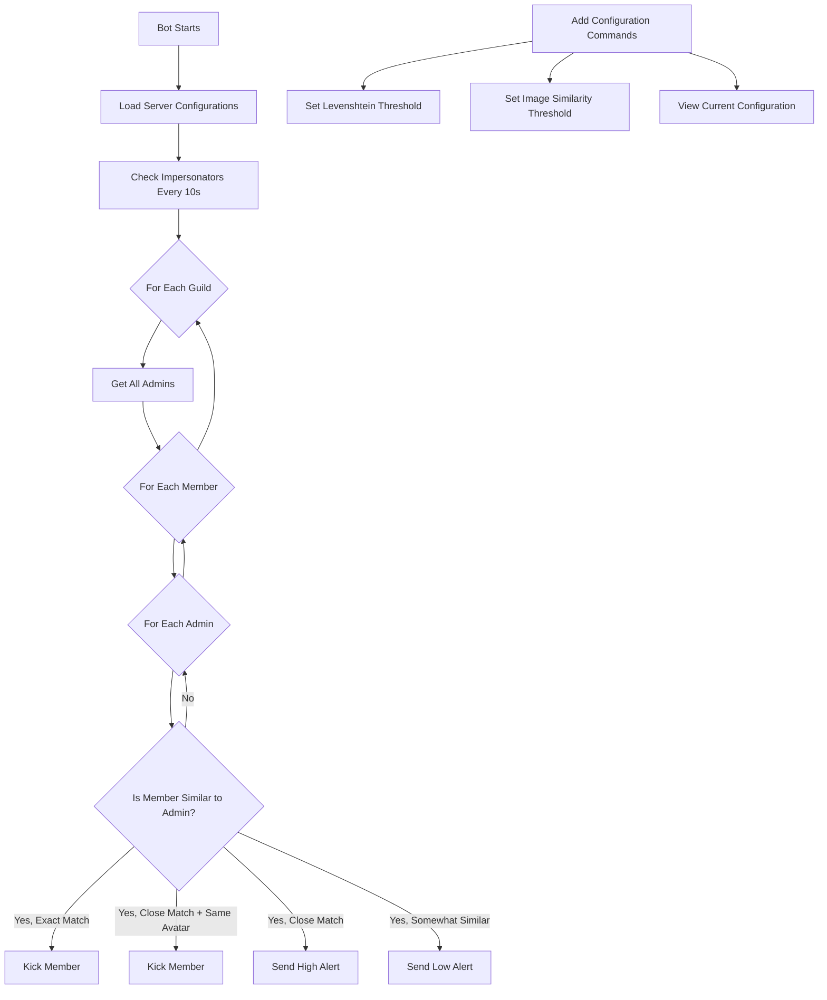

# Detailed Plan: Extending PhantomChaser to Protect All Admins

## Current System Overview

The PhantomChaser bot currently protects against impersonation of the server owner by:
- Checking for impersonators every 10 seconds
- Using regex patterns and Levenshtein distance to detect similar usernames/nicknames
- Using image hashing to compare profile pictures
- Kicking users who are clearly impersonating the owner
- Creating alert channels to notify admins about potential impersonators



## Proposed Changes

### 1. Extend Protection to All Admins

Currently, the bot only checks for impersonation of the server owner. We'll modify it to:
- Identify all users with admin privileges
- Check each member against all admins
- Apply the same detection logic to each admin

### 2. Maintain Tiered Approach

We'll keep the current tiered approach but apply it to all admins:
- Auto-kick for obvious impersonation (exact matches or high similarity with matching avatar)
- High alerts for close matches
- Low alerts for somewhat similar names

### 3. Add Configurable Thresholds

We'll add server-specific configuration options:
- Configurable Levenshtein distance thresholds for username/nickname similarity
- Configurable image similarity threshold for avatar comparison
- Store these configurations in a database or config file per server

## Technical Implementation Plan



## Detailed Code Changes

### 1. Create a Configuration System

We'll need to create a configuration system to store and retrieve server-specific settings:
- Create a new file `config.py` to handle configuration management
- Use JSON or a database to store configurations
- Implement commands to update configurations

Example configuration structure:
```json
{
  "guild_id": {
    "levenshtein_threshold": 2,
    "image_similarity_threshold": 0.9,
    "auto_kick": true
  }
}
```

### 2. Modify the Impersonator Detection Logic

Update the `check_impersonators` function to:
- Get all admins in the server
- Check each member against each admin
- Apply the appropriate action based on the similarity and configuration

Pseudocode for the updated function:
```python
@tasks.loop(seconds=10)
async def check_impersonators():
    for guild in bot.guilds:
        try:
            # Get guild configuration
            guild_config = config.get_guild_config(guild.id)
            levenshtein_threshold = guild_config.get("levenshtein_threshold", 2)
            image_similarity_threshold = guild_config.get("image_similarity_threshold", 0.9)
            
            # Get all admins
            admins = [member for member in guild.members if member.guild_permissions.administrator]
            
            for member in guild.members:
                # Skip admins
                if member.guild_permissions.administrator:
                    continue
                    
                for admin in admins:
                    # Check for impersonation
                    is_impersonating = check_impersonation(member, admin, levenshtein_threshold)
                    
                    if is_impersonating:
                        # Check profile picture
                        is_profile_same = await misc.compare_profile_pic(member, admin, image_similarity_threshold)
                        
                        # Apply appropriate action
                        if is_impersonating == "exact" or (is_impersonating == "close" and is_profile_same):
                            await member.kick(reason=f"Impersonating admin {admin.name}")
                            await misc.alert_message(member, "alert", guild, is_profile_same, admin)
                        elif is_impersonating == "close":
                            await misc.alert_message(member, "high-assist", guild, is_profile_same, admin)
                        else:  # somewhat similar
                            await misc.alert_message(member, "assist", guild, is_profile_same, admin)
        except Exception as e:
            print(f"Error in check_impersonators: {e}")
```

### 3. Update Utility Functions

Modify the utility functions in `misc.py`:
- Update `compare_profile_pic` to use configurable thresholds
- Update `alert_message` to include which admin is being impersonated
- Create new functions to handle admin-specific checks

Example updates:
```python
async def compare_profile_pic(member, admin, threshold=0.9):
    # Get avatar URLs
    admin_avatar_url = admin.avatar.url
    member_avatar_url = member.avatar.url
    
    # Download avatars
    admin_avatar_response = requests.get(admin_avatar_url)
    member_avatar_response = requests.get(member_avatar_url)
    
    # Open images
    admin_avatar_image = Image.open(BytesIO(admin_avatar_response.content))
    member_avatar_image = Image.open(BytesIO(member_avatar_response.content))
    
    # Calculate hashes
    admin_avatar_hash = imagehash.phash(admin_avatar_image)
    member_avatar_hash = imagehash.phash(member_avatar_image)
    
    # Calculate similarity
    distance = Levenshtein.hamming(str(admin_avatar_hash), str(member_avatar_hash))
    similarity = 1.0 - (distance / len(str(admin_avatar_hash)))
    
    # Check if similar
    if similarity >= threshold:
        return 1
    else:
        return 0

async def alert_message(member, type, guild, is_profile_same, admin=None):
    if is_profile_same == 0:
        profile_matches = "NO"
    else:
        profile_matches = "YES"
    
    admin_info = f"Admin: {admin.name}#{admin.discriminator}" if admin else "Owner"
    
    if type=='alert':
        channel_name = "impersonation-alerts"   
        message = f"Impersonator kicked:\nUsername: {member}\nTag: {member.discriminator}\nNickname: {member.display_name}\nID= {member.id}\nPhoto matches? {profile_matches}\nImpersonating: {admin_info}"
    elif type =='assist':
        channel_name = "impersonation-assist"
        message = f"(LOW ALERT) I think this person might be impersonating. Please check if you need to kick this person? :\nUsername: {member}\nTag: {member.discriminator}\nNickname: {member.display_name}\nID = {member.id}\nPhoto matches? {profile_matches}\nPossibly impersonating: {admin_info}"
    elif type =='high-assist':
        channel_name = "impersonation-assist"
        message = f"(HIGH ALERT) I think this person might be impersonating. Please check if you need to kick this person? :\nUsername: {member}\nTag: {member.discriminator}\nNickname: {member.display_name}\nID = {member.id}\nPhoto matches? {profile_matches}\nPossibly impersonating: {admin_info}"
    
    # Rest of the function remains the same
```

### 4. Add Configuration Commands

Add new bot commands:
- `!config set levenshtein <value>` - Set the Levenshtein distance threshold
- `!config set similarity <value>` - Set the image similarity threshold
- `!config view` - View current configuration

Example implementation:
```python
@bot.command(name="config")
@commands.has_permissions(administrator=True)
async def config_command(ctx, action=None, setting=None, value=None):
    if action is None:
        await ctx.send("Usage: !config [set|view] [setting] [value]")
        return
        
    if action.lower() == "view":
        # Get current configuration
        guild_config = config.get_guild_config(ctx.guild.id)
        
        # Create embed
        embed = discord.Embed(title="Server Configuration", color=discord.Color.blue())
        embed.add_field(name="Levenshtein Threshold", value=guild_config.get("levenshtein_threshold", 2))
        embed.add_field(name="Image Similarity Threshold", value=guild_config.get("image_similarity_threshold", 0.9))
        
        await ctx.send(embed=embed)
    elif action.lower() == "set":
        if setting is None or value is None:
            await ctx.send("Usage: !config set [levenshtein|similarity] [value]")
            return
            
        if setting.lower() == "levenshtein":
            try:
                threshold = int(value)
                if threshold < 1 or threshold > 5:
                    await ctx.send("Levenshtein threshold must be between 1 and 5")
                    return
                    
                config.set_guild_config(ctx.guild.id, "levenshtein_threshold", threshold)
                await ctx.send(f"Levenshtein threshold set to {threshold}")
            except ValueError:
                await ctx.send("Value must be a number")
        elif setting.lower() == "similarity":
            try:
                threshold = float(value)
                if threshold < 0.5 or threshold > 1.0:
                    await ctx.send("Similarity threshold must be between 0.5 and 1.0")
                    return
                    
                config.set_guild_config(ctx.guild.id, "image_similarity_threshold", threshold)
                await ctx.send(f"Image similarity threshold set to {threshold}")
            except ValueError:
                await ctx.send("Value must be a number")
        else:
            await ctx.send("Unknown setting. Available settings: levenshtein, similarity")
    else:
        await ctx.send("Unknown action. Available actions: set, view")
```

## Implementation Steps

1. **Create Configuration System**
   - Implement configuration storage and retrieval
   - Add default configurations

2. **Extend Admin Detection**
   - Modify the main loop to check against all admins
   - Update the comparison logic

3. **Update Alert System**
   - Enhance alert messages to include which admin is being impersonated
   - Ensure proper channel creation and permissions

4. **Add Configuration Commands**
   - Implement command handlers
   - Add validation and error handling

5. **Testing**
   - Test with various scenarios
   - Verify proper detection and actions

6. **Documentation**
   - Update README with new features
   - Document configuration options

## Estimated Timeline

- Configuration System: 1 day
- Admin Detection Extension: 2 days
- Alert System Updates: 1 day
- Configuration Commands: 1 day
- Testing and Refinement: 2 days
- Documentation: 1 day

Total: Approximately 8 days of development time